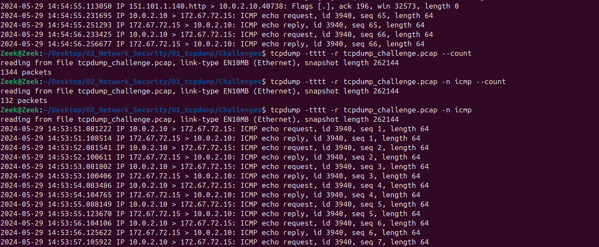
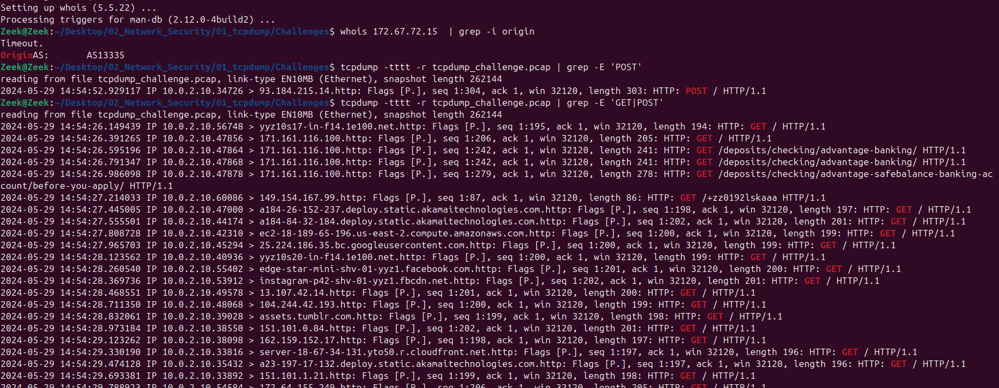
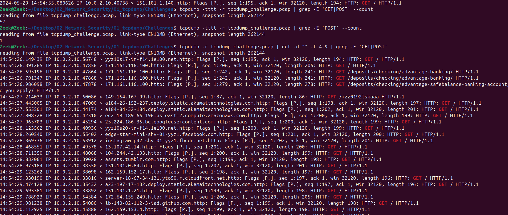
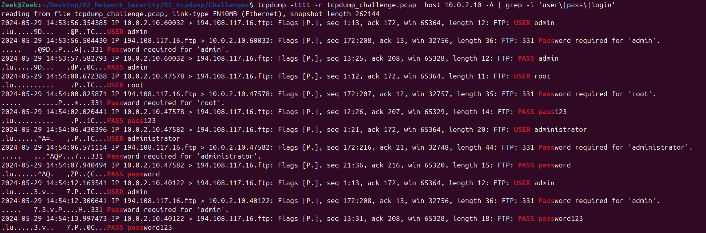
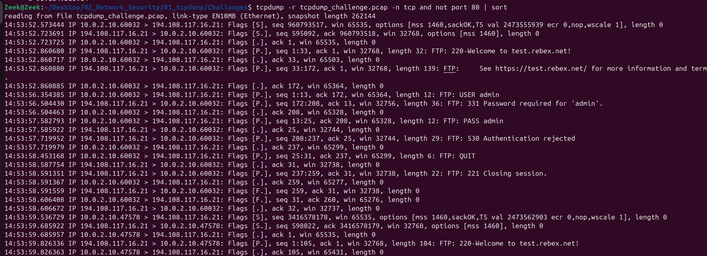
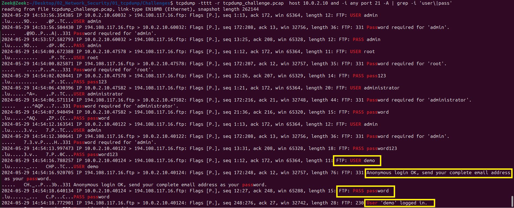
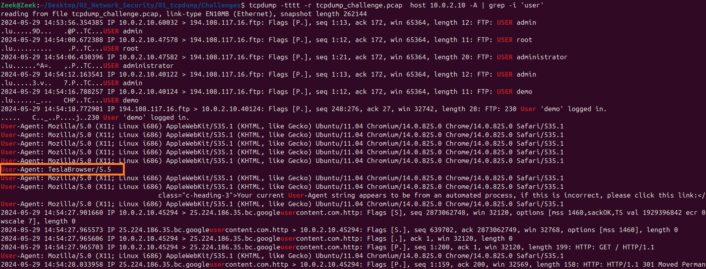
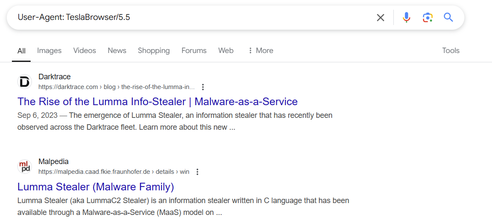
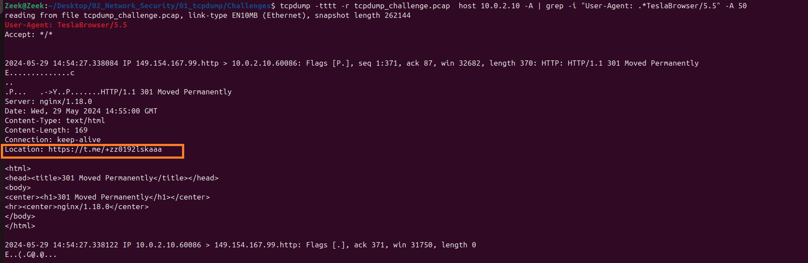

# Network Security - Pcap File Analysis using tcpdump

This repository contains scripts and resources for analyzing a **pcap file** using `tcpdump`. It includes general commands for working with `tcpdump` and a specific analysis script that examines a given pcap file.

## Overview

- `tcpdump.sh` → Contains general **tcpdump** commands that can be used for packet capturing, filtering, and analysis.
- `pcap_analysis.sh` → A script that specifically analyzes the pcap file and extracts relevant network traffic information.
- `screenshots/` → Contains screenshots of important command outputs from the analysis.

## Pcap File Source

The pcap file used for analysis was obtained from:  
[https://github.com/MalwareCube/SOC101/blob/main/course_files/02_Network_Security.zip]  

Thank you TCM security for providing this pcap file.

**Note**: The pcap file is **not** included in this repository. 


## How to Use

1. Ensure `tcpdump` is installed:
    ```bash
    sudo apt-get install tcpdump
    ```

2. To view general **tcpdump** commands:
    ```bash
    cat tcpdump.sh
    ```

3. To run the **pcap file analysis script**:
    ```bash
    bash pcap_analysis.sh
    ```

4. Refer to the **screenshots/** folder for captured results.

## Screenshots 

###Below screenshots shows the output and the commands 

1. The total number of packets and icmp packets
Refer to 

2. ASN  
Refer to 

3. HTTP GET and POST requests
Refer to 

4. Extract the fields and excluding the date
Refer to 

5. Host information in the ASCII format
Refer to 

6. Found Credentials
Refer 

7. Other well-known TCP port other than HTTP port 80
Refer to 

8. Credentials used to access the file sharing server for sharing file
Refer to 

9. Finding unique user from User-Agent
Refer to 

10. OSINT to find the Malware
Refer to 

11. URL that the endpoint tried to connect to the User-Agent
Refer to 


